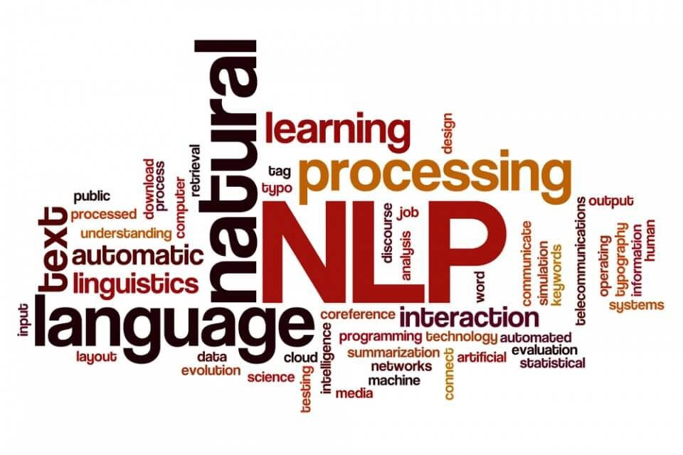

# NLP

# Natural Language Processing (NLP) 

This repository is dedicated to the study of Natural Language Processing (NLP), a field of artificial intelligence focused on the interaction between computers and human language. Here, you will find notes, implementations, and resources related to NLP.

## Table of Contents

- [Introduction](#introduction)
- [Contents](#contents)
- [Getting Started](#getting-started)
- [Contributing](#contributing)
- [License](#license)

## Introduction

Natural Language Processing is a fascinating field that explores the interaction between computers and human language. It encompasses a wide range of tasks, from text analysis and sentiment analysis to machine translation and chatbot development. This repository is your gateway to exploring NLP concepts and practical implementations.

## Contents

Here's what you can find in this repository:

- **Notes**: Detailed explanations of NLP concepts and techniques.
- **Implementations**: Practical code examples and projects related to NLP.
- **Resources**: Links to valuable NLP resources, books, and articles.

## Getting Started

To get started with NLP and this repository, you can:

1. Clone the repository to your local machine:

   git clone https://github.com/Ahmad10Raza/NLP.git

2. Explore the 'Notes' directory for comprehensive explanations of NLP topics.

3. Check out the 'Implementations' directory for code examples and projects.
4. Visit the 'Resources' section for links to valuable NLP books, courses, and articles.

## Contributing

If you'd like to contribute to this repository, you are welcome to do so. Whether it's fixing a typo in the notes, adding a new code implementation, or suggesting valuable resources, your contributions are appreciated. Please follow our [Contribution Guidelines](CONTRIBUTING.md).

## License

This repository is open-source and available under the [MIT License](LICENSE).

Happy exploring NLP and enhancing your understanding of human language with the power of AI!
